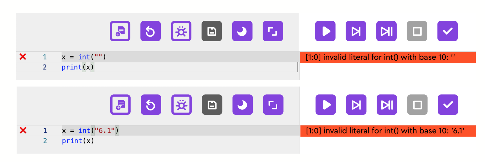
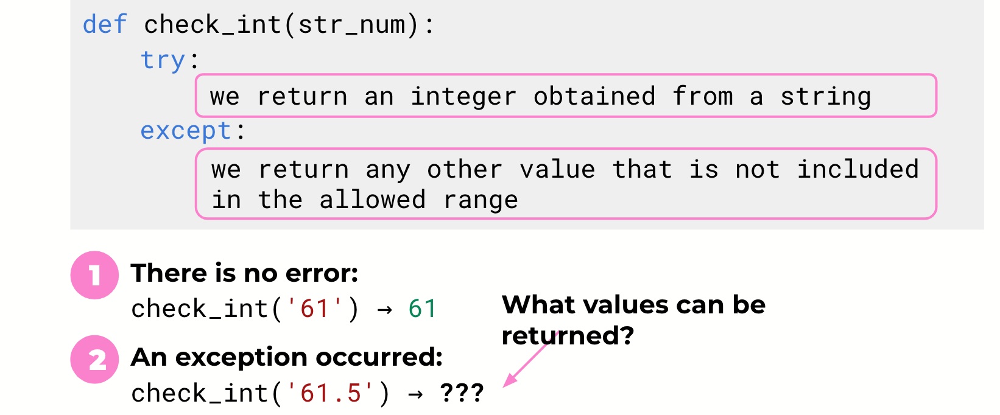

# 1. Incorrectly entered data

### 1.1. Pulse and age values are not integers.
### 1.2. The user did not enter their response; the field is empty.
### 1.3. The age is less than 7.
### 1.4. Pulse is a negative number.

How can we check whether the user has entered an integer or not?

# 2. Exceptions handling

# Students' Implementation

### 1. class InstrScr()

        ...
        def check_int(str_num):
            try:
                return int(str_num)
            except:
                return False

        class InstrScr(Screen):
            ...
            def press_next(self):
                ...
                age = check_int(self.in_age.text)
                if age == False or age < 7:
                    age = 7
                else:
                    self.manager.current = 'pulse1'
        ...

### 2. 