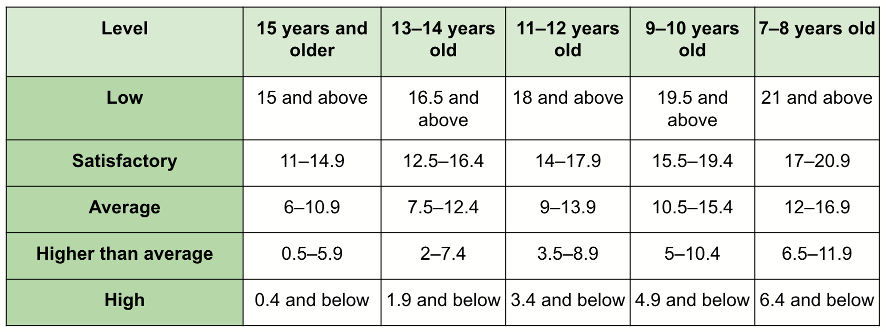

# Ruffier-Test

The Ruffier Test app will help users evaluate the condition of their cardiovascular system.  

It’s intended to observe the work of the heart when it’s under physical strain and evaluate the effectiveness of that work.

## MVP mobile app

In this module, MVP mobile app is for evaluating the effectiveness of the cardiovascular system based on the Ruffier test. You will able to test this app on potential users.

These very simple apps are also known as a minimum viable product (MVP).
An MVP has only the necessary features that are enough to check the app’s functionality.

### 1). how the test is carried out.

Step 1 - Rest for a few minutes and take your pulse for 15 seconds.
Step 2 - Do 30 squats in 45 seconds.
Step 3 - Take your pulse for 15 seconds.
Step 4 - Rest for 30 seconds.
Step 5 - Take your pulse for 15 seconds.
Step 6 - Show the result.

#### evaluation correlates with age

### 2). Necessary data that the user must enter:

Name, Age, and The three results from taking their pulse.

### 3). The heart’s efficiency is evaluated according to the formula

- Ruffier index = ( 4 * (P1 + P2 + P3 + P4) - 200 ) / 10 

P1, P2, and P3 are the results of the pulse readings.

